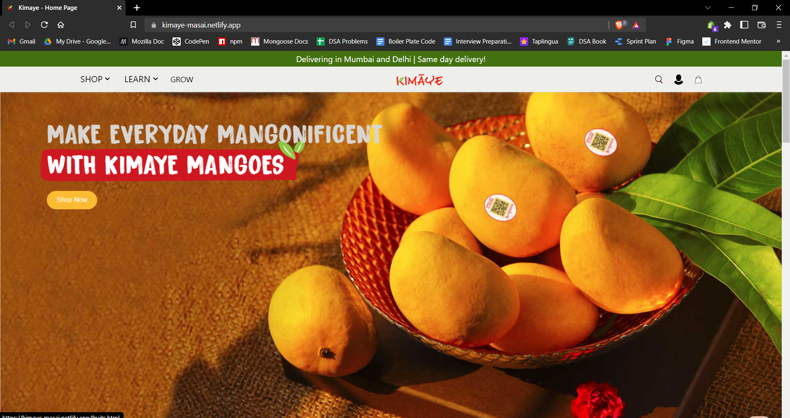
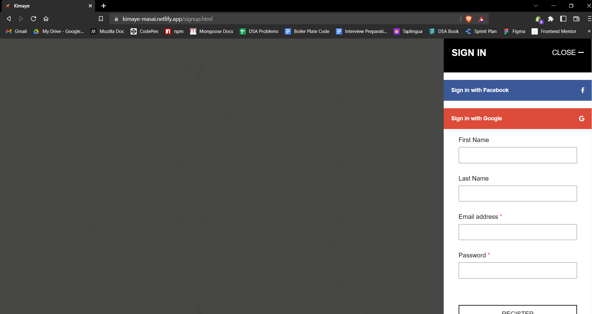
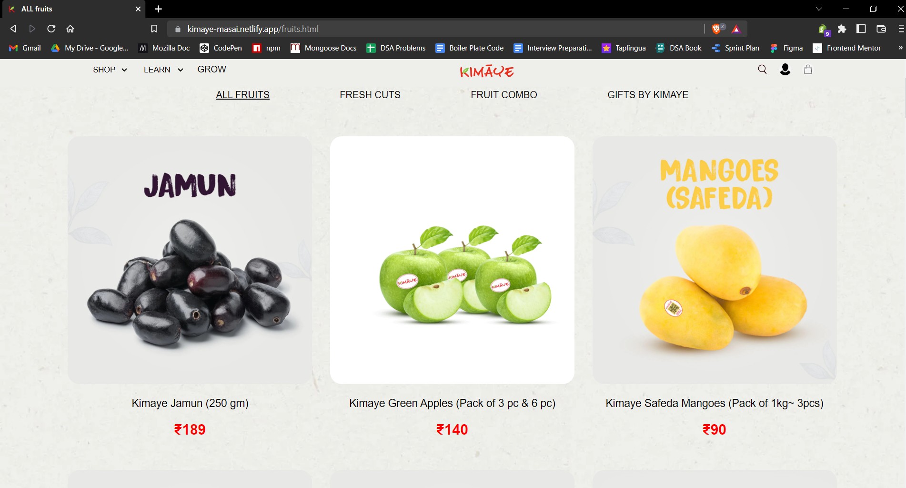
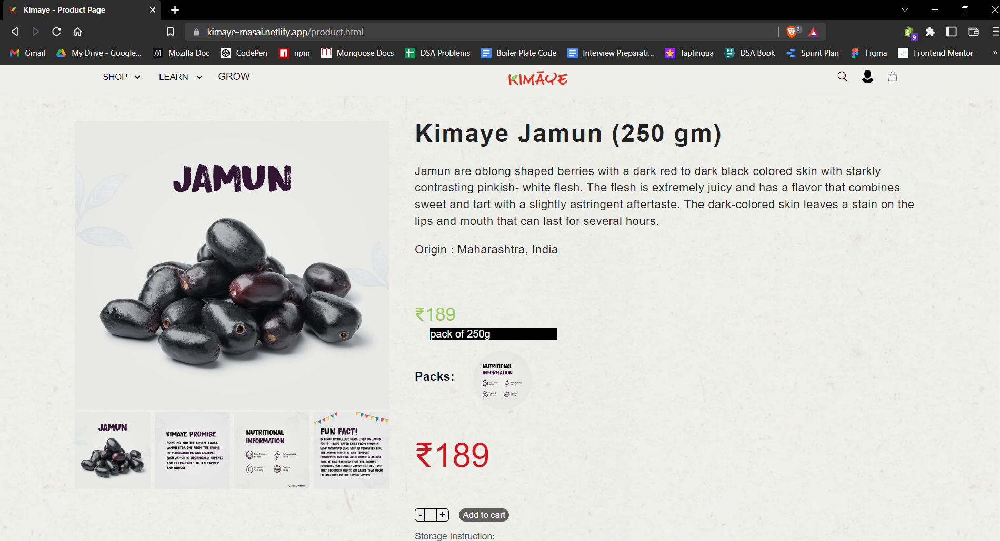
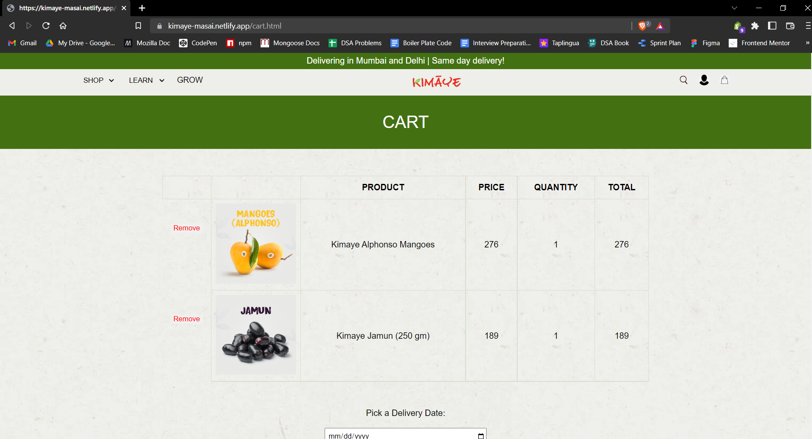
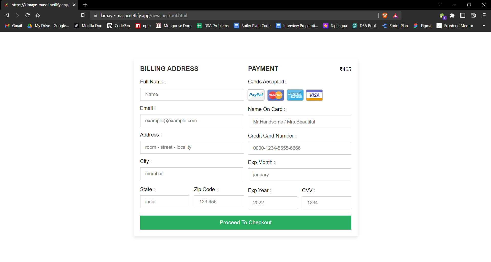
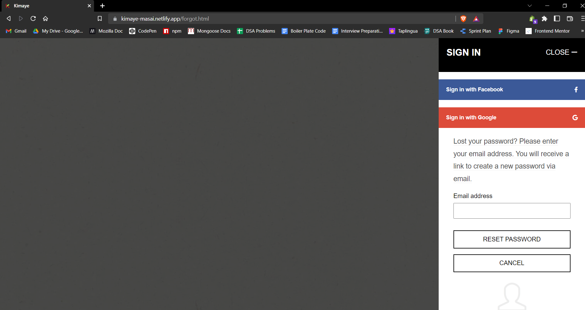
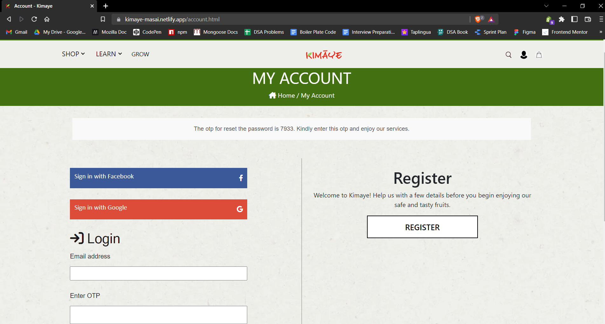
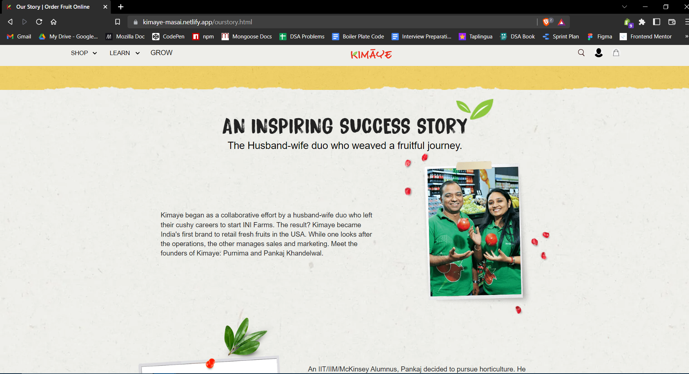
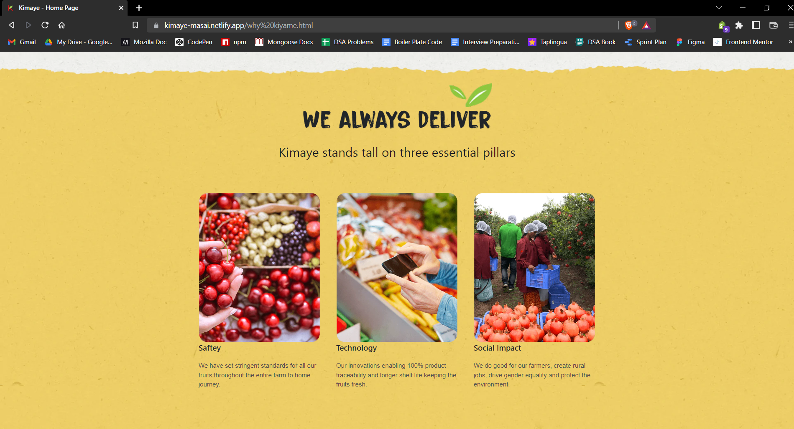

# Kimaye Clone by Team-Kimaye

Hello everyone we are a group of six peoples and we cloned a kimaye website by using HTML, CSS, JS.
- Netlify link:- https://kimaye-masai.netlify.app.

## Features

- Homepage with carousel feature:- Humam Ul Islam.
- Signup & login page with random otp feature:- Harshal Pardeshi.
- Cart page with adding and removing items:- Dilip Kumar.
- Product page with sorting feature:- Rohit Mourya.
- Grow page with description and search feature:- Prashant Kumar.
- Learn pages with sorting feature:- Abhay Kumar Agrawal.
- Created responsive by using media queries.

## Screenshots

### 1. Home Page

### 2. Login Page

### 3. Signup Page

### 4. Products Page

### 5. Product View

### 6. Cart Page

### 7. Checkout Page

### 8. Fogot Password Page

### 9. My Account Page

### 10. Our Story Page

### 11. Why Kimaye Page

## LinkedIn profiles

- [Humam UI Islam](https://www.linkedin.com/in/humamul/)
- [Harshal Pardeshi](https://www.linkedin.com/in/harshalpardeshi/)
- [Dilip Kumar](https://www.linkedin.com/in/dilip-kumar1912/)
- [Rohit Mourya](https://www.linkedin.com/in/rohit-mourya/)
- [Prashant Kumar](https://www.linkedin.com/in/prashant-kumar-346037159/)
- [Abhay Agarwal](https://www.linkedin.com/in/abhay-agrawal-120731178/)

## Feedback

If you have any feedback, please reach out to us at:
- Humam UI Islam => humam.alam19@gmail.com
- Harshal Pardeshi => pardeshiharshal90@gmail.com
- Dilip Kumar => dilip19121998@gmail.com
- Rohit Mourya => rohitmourya0012@gmail.com
- Prashant Kumar => kumar.prashant477@gmail.com
- Abhay Agarwal => abhaytalkin@gmail.com
